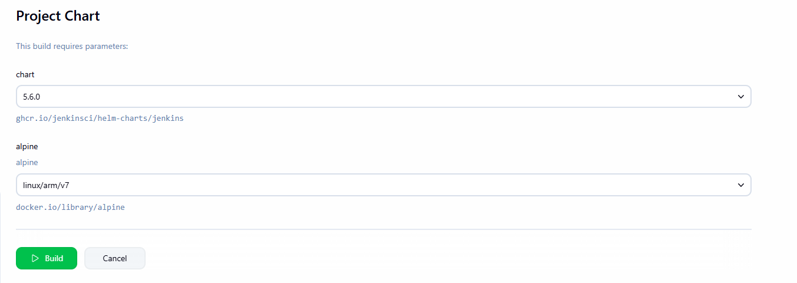
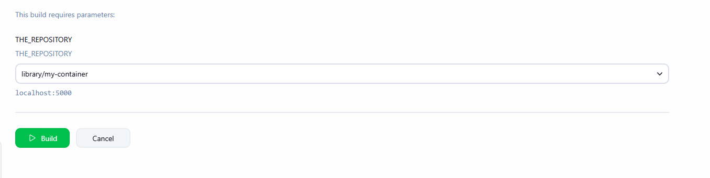

# ORAS parameters Jenkins plugin

This plugin allow to define new parameter types in Jenkins to list ORAS Artifacts tags or platform (including container images)

> [!WARNING]
> The ORAS Java SDK is currently in **alpha** state and might impact the stability of this plugin.
>
> It's configuration and APIs might change in future releases

## Getting started

On job configuration you can configure the parameters.

For example for listing tags of an OCI helm chart.

And listing platforms for an OCI container image.

This will render a dropdown with the available tags for the selected chart.

The repository parameter allow to list available repositories in a registry.

Note this is not supported on multi-tenant registries such as GHCR or Docker.io

Authentication is optional and will use default credentials location if available on the controller.

See [ORAS Java SDK](https://github.com/oras-project/oras-java?tab=readme-ov-file#authentication) for more details.

## Environment vars

When using ORAS Tag parameters the following env vars are available for the build:

- `<PARAMETER_NAME>` the resolved reference such as `ghcr.io/jenkinsci/helm-charts/jenkins@sha256:42869d33a9b684f4c960b0256f1c0a444750b6e9fc70d03b929e84d7c728e19a` (always set)
- `<PARAMETER_NAME>_TAG` the selected tag such as `5.6.0` (always set)
- `<PARAMETER_NAME>_REGISTRY` the resolved registry such as `ghcr.io` (always set)
- `<PARAMETER_NAME>_REPOSITORY` the resolved repository such as `jenkinsci/helm-charts/jenkins` (always set)
- `<PARAMETER_NAME>_DIGEST` the resolved digest such as `sha256:42869d33a9b684f4c960b0256f1c0a444750b6e9fc70d03b929e84d7c728e19e` (only set if valid tag)
- `<PARAMETER_NAME>_TITLE` title annotation such as `jenkins` (if available)
- `<PARAMETER_NAME>_DESCRIPTION` description annotation (if available)
- `<PARAMETER_NAME>_CREATED` created annotation such as `2024-09-12T16:01:30Z` (if available)
- `<PARAMETER_NAME>_SOURCE` source annotation such as `https://github.com/jenkinsci/jenkins` (if available)

In addition when selecting ORAS platform parameter the following env vars are available:

- `<PARAMETER_NAME>_PLATFORM_OS` the selected OS of the platform such as `linux` (always set)
- `<PARAMETER_NAME>_PLATFORM_ARCH` the selected ARCH of the platform such as `amd64` (always set)
- `<PARAMETER_NAME>_PLATFORM_VARIANT` the selected VARIANT of the platform such as `v8` (if available)
- `<PARAMETER_NAME>_PLATFORM_OS_VERSION` the selected os version of the platform such as `12.0` (if available)

## Contributing

Refer to our [contribution guidelines](https://github.com/jenkinsci/.github/blob/master/CONTRIBUTING.md)

## LICENSE

Licensed under MIT, see [LICENSE](LICENSE.md)

